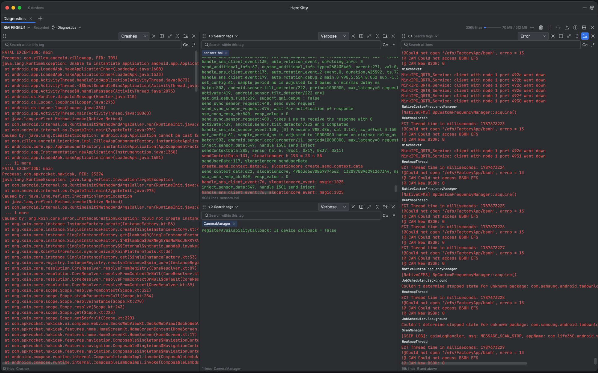

# HereKitty

**A logcat viewer that lets you watch several sides of a conversation at once.**

Plug in an Android device and HereKitty records everything it emits for the whole session. Instead
of one scrolling wall of text, you open as many independently filtered panes as you need, side by
side — so what the app sends, what the hardware receives, what the hardware replies with, and what
the app does in response are all readable against each other, at the same time, without re-running
anything.



## Get HereKitty

No account, no build tools, no command line required.

1. Go to the **[Releases](../../releases/latest)** page and download the latest `.dmg` (Apple
   Silicon Macs only).
2. Open the `.dmg` and drag **HereKitty** into Applications.
3. **The first launch needs one extra click.** HereKitty isn't signed with an Apple Developer
   account, so macOS Gatekeeper will refuse to open it normally the first time. Instead of
   double-clicking, **right-click (or Control-click) the app and choose "Open"**, then confirm in
   the dialog that appears — you only need to do this once. If macOS still blocks it, go to
   **System Settings → Privacy & Security**, scroll down, and click **Open Anyway** next to
   HereKitty's name.
4. Plug in an Android phone or tablet over USB. If it's the first time that computer has debugged
   that device, tap **Allow** on the "Allow USB debugging?" prompt that appears on the phone
   itself. (This needs [Developer Options](https://developer.android.com/studio/debug/dev-options)
   and USB debugging turned on in the device's settings.)
5. Open HereKitty and pick the device from the source picker. If the app can't find `adb` on your
   Mac, it offers to download Google's official platform-tools for you — there's nothing to
   install by hand.

## Why HereKitty

Plain `adb logcat` gives you one stream and one filter — everything is either in view or gone.
HereKitty keeps the whole session in memory and lets every pane query it independently, so you can
build up exactly the set of lenses your debugging session needs and rearrange them as you go,
without losing anything you haven't scrolled past yet.

## What you can do with it

**Filter without typing.** Every tag the session has seen shows up in a searchable list.
Double-click a tag on any log line to add or remove it from that pane's filter instantly — no
query syntax needed. Search by text too, with case-matching and regex when you need them, plus a
one-click "crashes only" filter.

**Split and rearrange panes with a click or a drag.** Right-click any tag and choose *Split
left/right/up/down* to pull it straight into a pane of its own. Prefer the mouse? Drag a tag onto
another pane's edge to split it there, or onto its middle to fold it into that pane's filter
instead. Drag a pane's own handle to reorder it among its siblings, or fold one pane back into
another from its toolbar when you no longer need it split out.

**Watch more than one thing at once.** Open a second device — or a second recording — beside or
below any session with one click, so two phones (or a phone and a saved capture) sit next to each
other on screen. Keep unrelated setups apart in separate tabs, each with its own layout, sources,
and filters.

**Save a setup, hand it to someone else.** Name a pane arrangement as a **view** and apply it again
later with one click, to the same device, a different device, or an imported recording — a view
holds only panes and filters, never a device, so it works on a teammate's machine exactly as it did
on yours. Export a view file to share it, or import one someone sent you.

**Record now, read later.** Every session is being captured the whole time it's open. Export the
logs alone (`.hklog.gz`), or export the logs *and* the view together as one `.hkbundle` file, so
whoever opens it sees your filtered panes already set up. Reopen either one later from **Open a
File** on the source picker — filtering, tagging, and splitting all work identically against an
imported file as they do against a live device.

**Pick up right where you left off.** Tabs, splits, and every pane's filter come back automatically
the next time you open HereKitty, and reattach to their devices as soon as adb reports them plugged
back in.

**Read dense logs comfortably.** Switch between a columnar layout and a compact "stacked" layout
that gives the message the full width of the pane. Toggle which columns show (timestamp, level,
tag, process/thread id, line wrapping), fold repeated lines into a single counted row, and zoom the
text size with `Cmd +` / `Cmd -` / `Cmd 0` from anywhere in the app. A one-click **compact view**
strips away every toolbar down to just the log text — press `Esc` to bring them back.

**Everything else you'd expect.** Pause and resume capture without losing what's already recorded,
restart a stuck stream, clear a session and start fresh, light/dark/system theming, and a built-in
updater that checks GitHub for new releases and installs them in place.

## The fast moves, at a glance

| Do this | To get this |
|---|---|
| Double-click a tag | Toggle it in or out of that pane's filter |
| Right-click a tag → *Split…* | Pull that tag into a brand-new pane beside or below |
| Drag a tag onto a pane's edge | Split a new pane there, filtered to that tag |
| Drag a tag onto a pane's middle | Fold that tag into the target pane's filter |
| Drag a pane's grip | Reorder panes within a session |
| Split / fold icons in a pane's toolbar | Split this pane, or fold it into another one |
| "Open another source" icons | Add a second device or recording beside/below this session |
| **+** on the tab strip | Open a new tab with its own layout |
| The view menu → **Save as** | Name the current pane setup so it comes back |
| The view menu → **Export… / Import…** | Share a view file, or load one someone sent you |
| Session toolbar → **Export ▾** | Save the recording alone, or logs + view as one bundle |
| The toolbar's compact-view icon | Hide every toolbar down to just the logs (`Esc` to undo) |

## Building it from source

For developers who want to run from a checkout or contribute changes.

Requires JDK 25 — Gradle provisions it for you — and `adb` on the machine.

```bash
./gradlew :desktopApp:run
```

If adb is not on `PATH` or under `ANDROID_HOME`, point `HEREKITTY_ADB` at the binary.

```
:desktopApp   main(), the window, starts Koin
:app          Compose UI and presenters
:domain       models, repository interfaces, coroutine base
:adb          the ADB host protocol and logcat parsing
:repository   session buffers, tag registry, filtered views
:injector     wires the modules together
```

See `CLAUDE.md` for architecture and build notes, and `PRESENTERS.md` for the presenter pattern.
